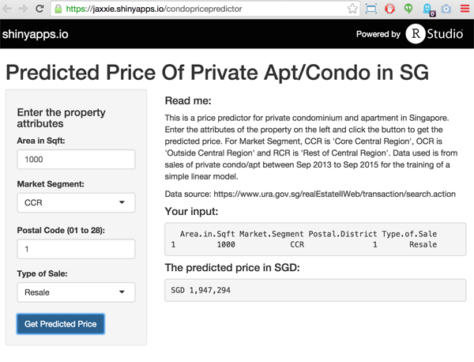

## Objective

1. To determine factors that affect private condo/apartment prices in Singapore
2. And to eventually predict the price given attributes of a property

--- .class #id

## Data Source

* We are using official data source from Urban Development Authority of Singapore. 
* Sales of private condo/apartment from Sep 2013 to Sep 2015 is used.
* We use a few features such as area of apartment, sales type, and location to determine the price.

---

## Modeling

* We use a linear model to model the price of the apartment. Here is the results of the model.

```{r, echo=FALSE}
setwd('/Users/kindaixin/MEGA/09 Developing Data Product/project')
load("linearModel.RData")
model
```

---

## Final Application

* The final application is one where you can enter the attributes of the property to get the predicted price. 
* It can be found at https://jaxxie.shinyapps.io/condopricepredictor



