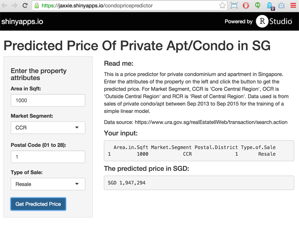

## Objective

1. To determine factors that affect private condo/apartment prices in Singapore
2. And to eventually predict the price given attributes of a property

--- .class #id

## Data Source

* We are using official data source from Urban Development Authority of Singapore. 
* Sales of private condo/apartment from Sep 2013 to Sep 2015 is used.
* We use a few features such as area of apartment, sales type, and location to determine the price.

---

## Modeling

* We use a linear model to model the price of the apartment. Here is the results of the model.


```
## 
## Call:
## lm(formula = Price ~ Area.in.Sqft + Market.Segment + Postal.District + 
##     Type.of.Sale, data = data <- train)
## 
## Coefficients:
##          (Intercept)          Area.in.Sqft     Market.SegmentOCR  
##               877388                  1538               -876572  
##    Market.SegmentRCR       Postal.District    Type.of.SaleResale  
##              -635675                -16605               -451186  
## Type.of.SaleSub Sale  
##               -16328
```

---

## Final Application

* The final application is one where you can enter the attributes of the property to get the predicted price. 
* It can be found at https://jaxxie.shinyapps.io/condopricepredictor



